# Viridisca LMS

Система управления обучением: backend — модульный монолит на ASP.NET Core (CQRS/MediatR, PostgreSQL), frontend — десктопное приложение на Avalonia. Репозиторий состоит из двух частей — `/server` и `/client`: backend реализует модули по мере необходимости под клиентские сценарии, а клиент постепенно переходит с прямого доступа к локальной базе на HTTP-обращения к backend API.

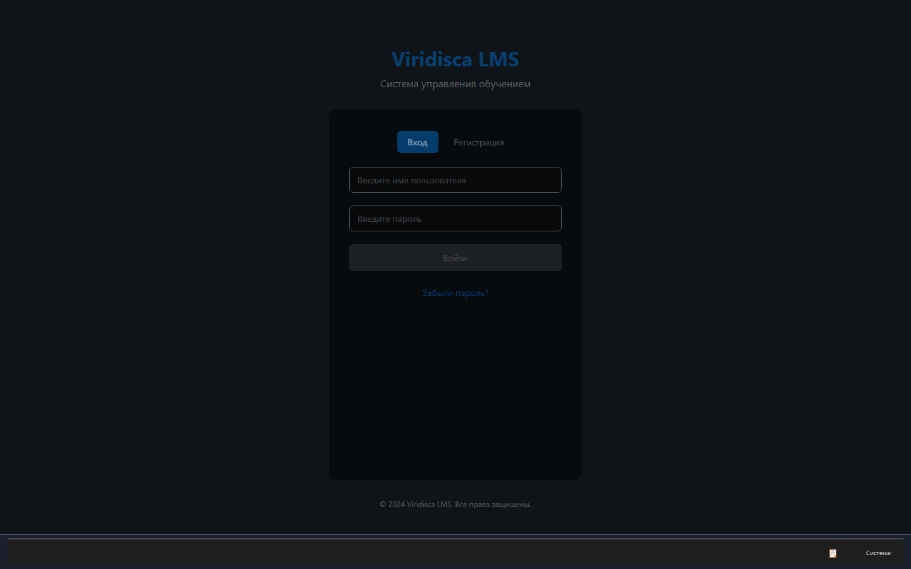

## Что умеет

- **Identity** — регистрация, вход, JWT + refresh-токены, роли и их назначение
- **Academic** — студенты, преподаватели, группы, предметы: CRUD, назначение предмета преподавателю, куратор группы, зачисление студента в группу с проверкой вместимости
- **Grading** — оценки с историей изменений (ревизии: кто/когда/почему изменил значение), публикация оценки
- **Curriculum** — учебные периоды, экземпляры курсов (предмет + группа + период + преподаватель), задания с публикацией, сдачи заданий с оценкой
- **Scheduler** — расписание занятий по дням недели, с серверной проверкой конфликта аудиторий (нельзя поставить два занятия в одну аудиторию на пересекающееся время)
- Массовые операции (выбрать несколько строк чекбоксами → одно действие сразу над всеми) — на страницах Студентов, Оценок, Заданий, Групп, Преподавателей и Курсов
- Клиент реализован по паттерну decorator: там, где backend уже поддерживает операцию, идёт HTTP-запрос; для всего остального — прозрачный откат на исходный EF Core-сервис клиента, без имитации успеха

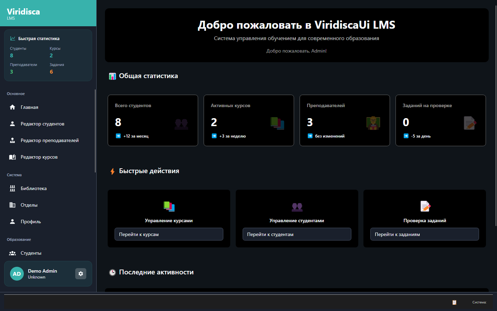

## Основные разделы

| | |
|---|---|
| 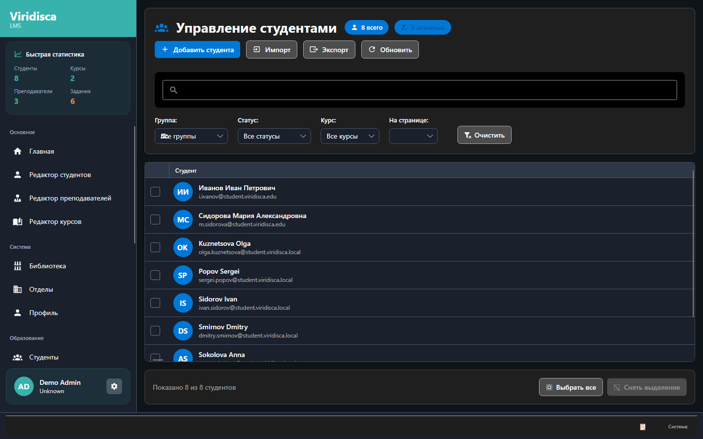 | 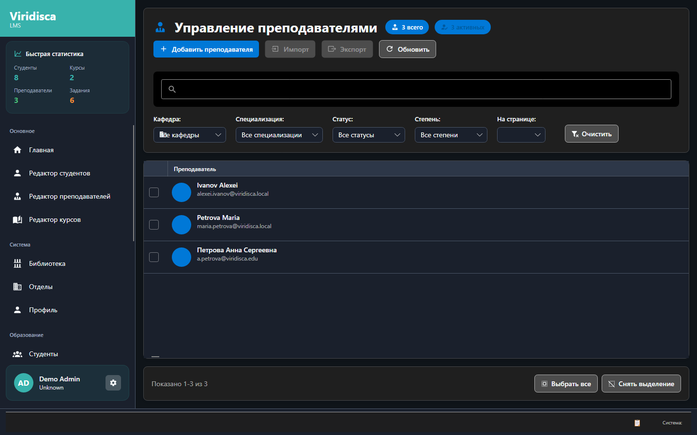 |
| 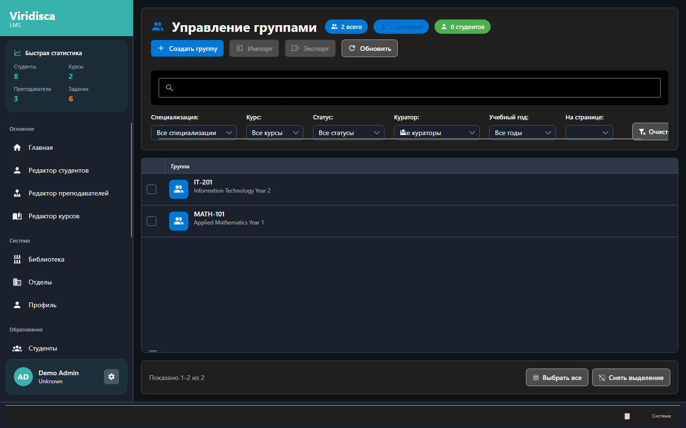 | 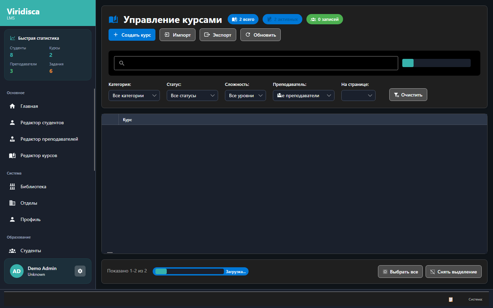 |
| 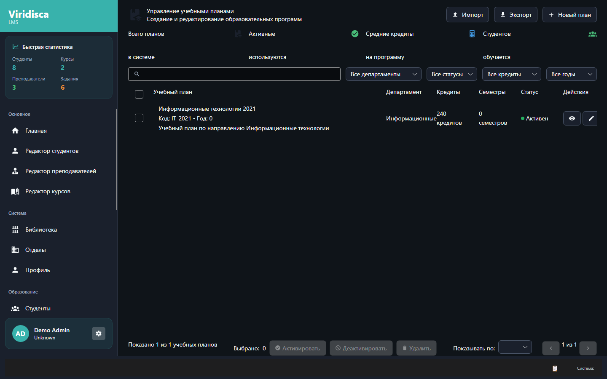 | 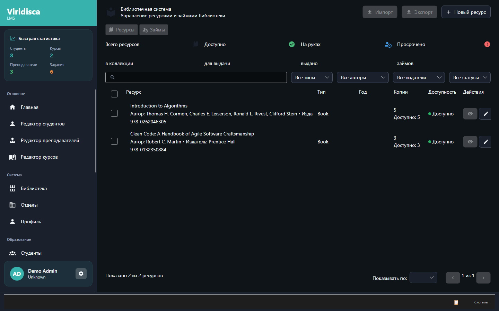 |
| 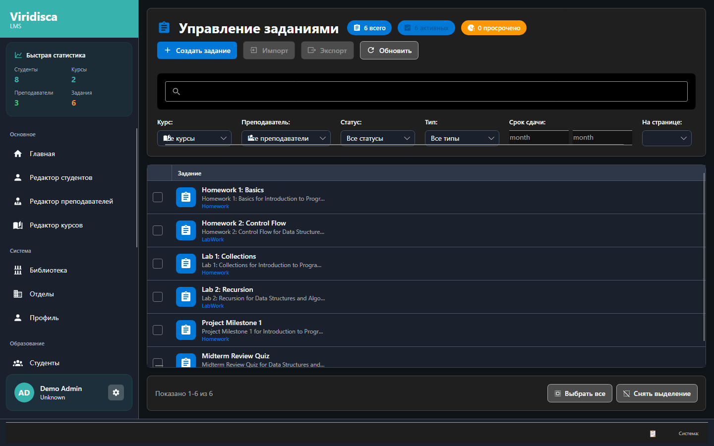 | 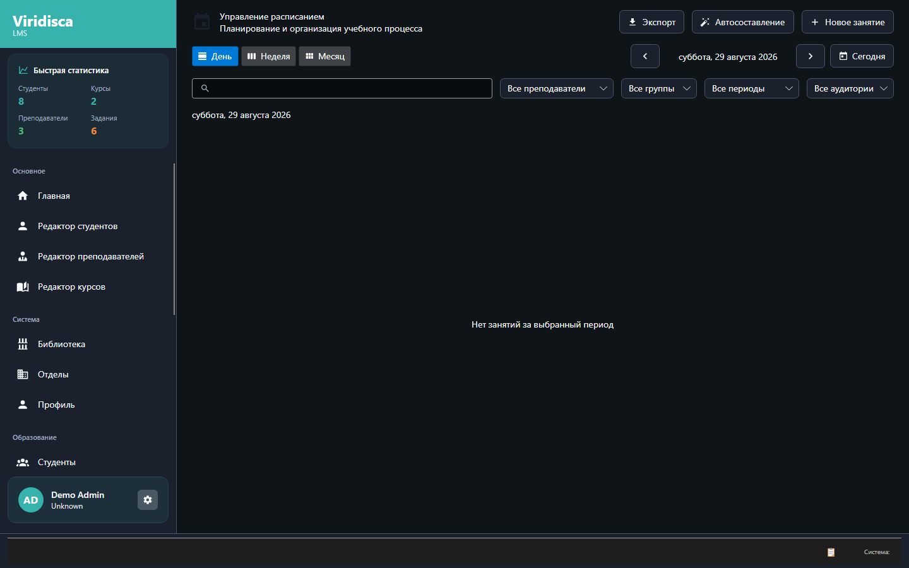 |
| 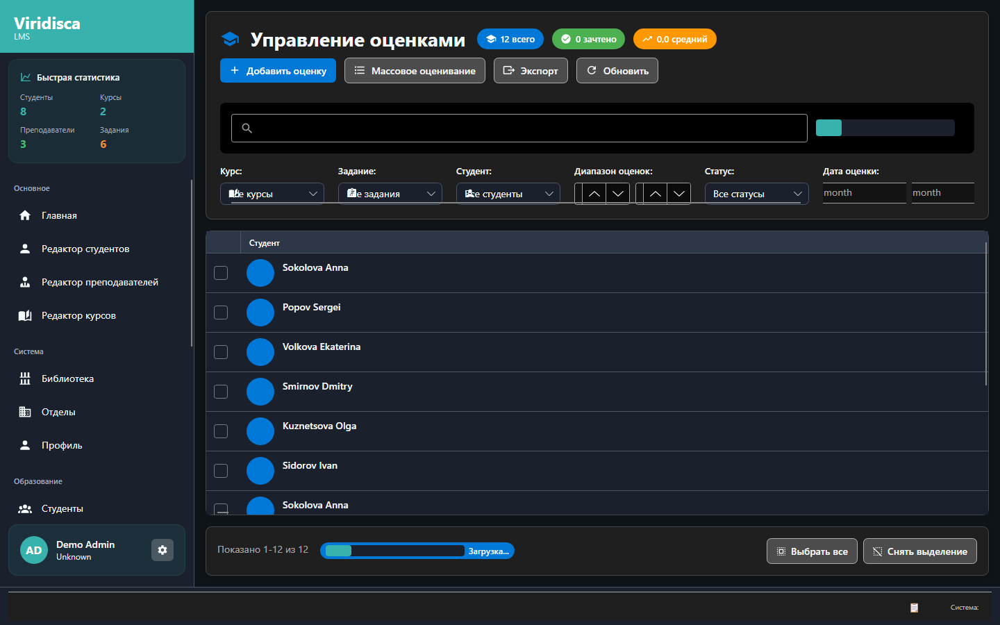 | |

## Стек

**Backend:** .NET 8 · ASP.NET Core (Minimal APIs) · MediatR (CQRS) · FluentValidation · EF Core 9 + Npgsql · PostgreSQL 16 · Serilog · JWT · Swagger/OpenAPI

**Client:** Avalonia UI 11 · ReactiveUI · EF Core (локальный fallback) · MVVM

## Запуск

**Backend + PostgreSQL** одной командой из корня репозитория:

```bash
docker compose up -d --build
```

API поднимется на `http://localhost:5280` (документация — на `/swagger`), миграции всех модулей применяются автоматически при старте. PostgreSQL — на `localhost:5435` (`viridisca` / `postgres` / `postgres`).

**Client** (десктоп, Windows/Avalonia):

```bash
cd client/src/Platform/ViridiscaUi.Desktop
dotnet run
```

Создайте `client/src/API/ViridiscaUi/appsettings.Development.json` (в репозитории его нет):

```json
{
  "Api": { "BaseUrl": "http://localhost:5280" },
  "ConnectionStrings": {
    "PostgreSQL": "Host=localhost;Database=viridisca_lms_dev;Username=viridisca_user;Password=viridisca_password;"
  }
}
```

`ConnectionStrings:PostgreSQL` — отдельная локальная база для функциональности, которую backend ещё не покрывает (посещаемость, аналитика, импорт/экспорт и т.п.). Для авторизации, студентов/преподавателей/групп/предметов, оценок, учебных периодов/курсов/заданий/сдач и расписания она не используется — эти экраны идут через HTTP API.

## Архитектура

- Backend — модульный монолит: 5 реализованных модулей (Identity/Academic/Grading/Curriculum/Scheduler), каждый со своими Domain/Application/Infrastructure/Presentation и собственной PostgreSQL-схемой; ещё несколько модулей (Analytics/Attendance/Communication/Finance) пока не реализованы
- Cross-module ссылки — обычные индексированные `Guid`-колонки без FK-констрейнта между схемами (например, `Curriculum.CourseInstance.TeacherUid` → `Academic`), а не project reference между модулями — модули остаются независимо компилируемыми
- CQRS: команды/запросы через MediatR, тонкие REST-эндпоинты (minimal API) поверх них
- Client — Clean Architecture (Domain/Infrastructure/Platform), decorator-паттерн для HTTP-миграции сервисов (подробности выше)

## Статус

Backend покрывает 5 из 10 запланированных модулей — остальные (Analytics/Attendance/Communication/Finance) пока не реализованы, так как не требуются текущим клиентским сценариям.

Навигация и модальные диалоги клиента покрыты автотестом: `client/tests/ViridiscaUi.HeadlessTests` — headless Avalonia-тест (`Avalonia.Headless`, без открытия окна), который логинится под демо-пользователем, обходит все зарегистрированные маршруты клиента (проверяя, что каждый реально открывается, а не тихо остаётся на предыдущей странице, с скриншотом на каждый) и отдельно воспроизводит DI-разрешение для всех модальных диалогов. Запуск:

```bash
cd client
dotnet test tests/ViridiscaUi.HeadlessTests/ViridiscaUi.HeadlessTests.csproj
```
